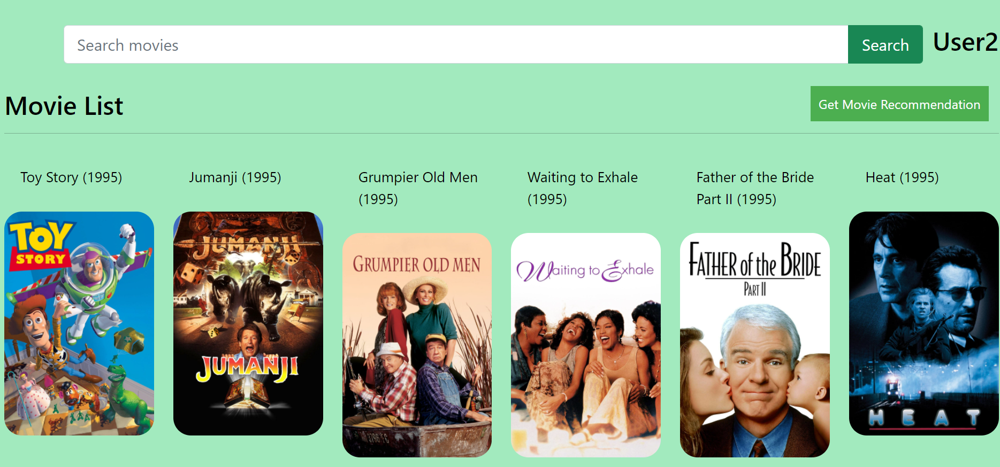
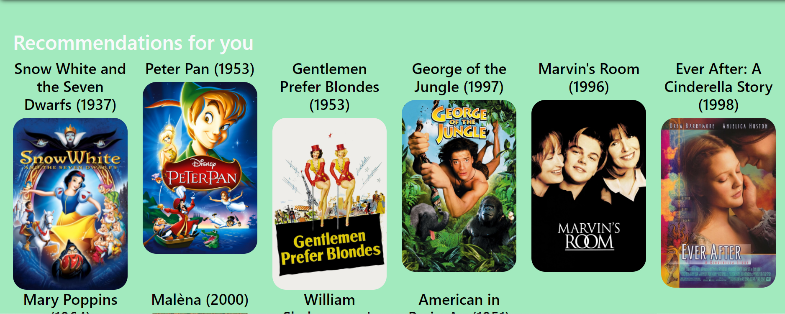

<h1 align="center">Microsoft Engage 2022
  
</h1>

<h2 align="center">Movie Recommendation System (Using Collaborative Filtering) </h2>

 <!-- TABLE OF CONTENTS -->

  
Table of Contents

  <ol>
    <li>
      <a href="#about-the-project">About The Project</a>
      <ul>
        <li><a href="#problem-statement">Problem Statement</a></li>
        <li><a href="#compatible-platforms">Compatible Platforms</a></li>
        <li><a href="#tech-stack">Tech Stack</a></li>
      </ul>
    </li>
    <li>
      <a href="#algorithms">Algorithms for Recommendation Engine</a>
      <ul>
        <li><a href="#collaborative-filtering">Collaborative Filtering</a></li>
        <li><a href="#pearson-correaltion">Pearson Correlation:USP of the project</a></li>
      </ul>
    </li>
    <li>
      <a href="#getting-started">Getting Started</a>
      <ul>
        <li><a href="#installation">Installation</a></li>
      </ul>
    </li>
    <li><a href="#navigating-through-the-app">Navigating through the App</a></li><ul>
        <li><a href="#login">Login</a></li>
        <li><a href="#home-page">Home Page</a></li>
        <li><a href="#get-recommendations">Get Recommendations</a></li>
      </ul>
    <li><a href="#future-scope">Future Scope</a></li>
    
  </ol>

<!-- ABOUT THE PROJECT -->

## About The Project
* This project was built during the Microsoft Engage 2022 program.
* It is a model based movie recommender system which recommends movie on the basis of ratings given by the user to other movies
* A user can create account, login, rate movies, get recommendations, add movies to Watchlist and check about the cast and crew of a particular movie using the tmbd API.

### Problem Statement
Demonstrate through your app the different kinds of algorithms that a web-streaming app (like Netflix) or an audio-streaming app (like Spotify) may use for their Recommendation Engine.

### Compatible Platforms
Laptops and Desktops.

### Tech Stack  
1.Front-end: HTML, CSS, Bootstrap, JavaScript
2. Back-end: Django

<!-- DIFFERENT RECOMMENDATION ENGINE -->

## Different Recommendation Engine
1. Content-Based Filtering
2. Memory-Based Collaborative Filtering
3. Model-Based Collaborative Filtering
4. Deep Learning / Neural Network

### Collaborative Filtering
There are 2 main types of memory-based collaborative filtering algorithms:
1.	User-User Collaborative Filtering: Here we find look alike users based on similarity and recommend movies which first user’s look-alike has chosen in past. 

2.	Item-Item Collaborative Filtering: It is quite similar to previous algorithm, but instead of finding user’s look-alike, we try finding movie’s look-alike. Once we have movie’s look-alike matrix, we can easily recommend alike movies to user who have rated any movie from the dataset. 

### Pearson Correlation
In the project ,I have userd user-user collaborative filtering using pearson coorelation. I have used the pivot table and correlation coefficient to recommend movies here. If the user likes a particular movie, it takes that movie’s columns and find the correlation of that column with all the other movie columns and get the movies that highly correlate with the chosen movie.

<!-- INSTALLATIONS -->

## Getting Started
To install and run the project on your local system, clone this repo to your local machine and open command prompt and go to that path:

### Set up virtual environment
>py -m venv venv
>[project path]/activate.bat

### Installation
sh
  pip install -r requirements.txt

* To run it on the local host-

To separately run the application on your local host,run the following command:

sh
  Python manage.py runserver

<!-- APP TUTORIAL-->
## Navigating Through The App
### Login 
Registered Users can login into their account using the username and password and can start rating the movies and then get recommendations.

 
### Home Page-
This page displays all the movies and users can click on the movie and give ratings and add them to list or can see the cast and crew of the movie. 

### Get Recommendations-
Registered users will get some recommendations based on the rating given by them by clicking on the button 'Get Recommendation' to get some recommendations.

